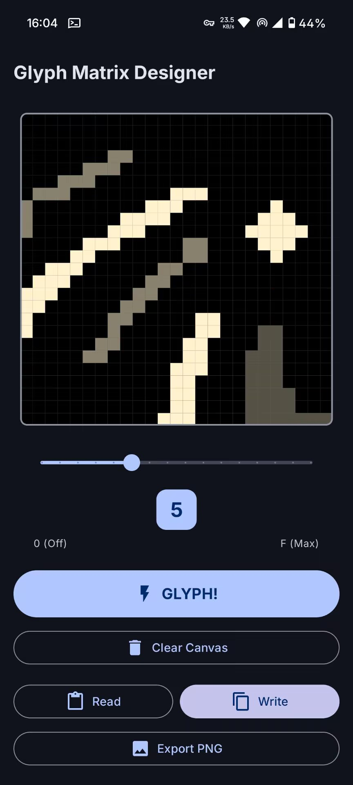
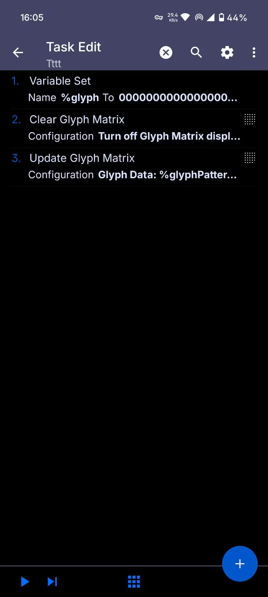

# GlyphMatrix Tasker Plugin

[Homepage](https://glyphmatrix.kunbot.org) | [Releases](https://github.com/Gennadiyev/GlyphMatrixTaskerPlugin/releases)

> [!IMPORTANT]
> This plugin requires a Nothing Phone with Glyph Interface support. It does **nothing** on other devices - its behaviour is not tested there.
>
> Currently, only static patterns are supported. Animated glyphs are not implemented yet - stay tuned for future updates!

A Tasker plugin for controlling Nothing Phone Glyph Matrix LEDs, allowing you to create custom light patterns and animations.

## Features

- **Visual Pattern Designer**: Draw custom glyph patterns on a grid interface
- **Brightness Control**: Adjust LED brightness from 0 (off) to F (max)
- **Tasker Integration**: Seamlessly integrate with Tasker automation tasks
- **Read/Write Patterns**: Save and load glyph patterns
- **Export**: Export patterns as PNG images

## Interface



## Usage

1. Install the app on your Nothing Phone
2. Open Tasker and create a new task
3. Add an action → Plugin → GlyphMatrix Tasker Plugin
4. Choose either "Update Glyph Matrix" or "Clear Glyph Matrix"
5. For Update: Design your pattern and set brightness
6. Save and run your task

## Tasker Actions

- **Update Glyph Matrix**: Display a custom pattern with specified brightness
- **Clear Glyph Matrix**: Turn off all glyph LEDs

## Requirements

- Nothing Phone with Glyph Interface
- Tasker app
- Android 8.0+

## Build Instructions

### Prerequisites

- Android Studio (latest stable version recommended)
- JDK 17 or higher
- Android SDK with API level 34+
- Glyph Matrix SDK (included in `app/libs/`)

### Building from Source

1. **Clone the repository**
   ```bash
   git clone git@github.com:Gennadiyev/GlyphMatrixTaskerPlugin.git
   cd GlyphMatrixTaskerPlugin
   ```

2. **Open in Android Studio**
   - Launch Android Studio
   - Select "Open an Existing Project"
   - Navigate to the cloned directory and select it

3. **Configure SDK path** (if needed)
   - Update `local.properties` with your Android SDK location:
     ```
     sdk.dir=/path/to/your/android/sdk
     ```

4. **Build the project**
   - From the menu: Build → Make Project
   - Or run: `./gradlew build`

5. **Install on device**
   - Connect your Nothing Phone via USB (with USB debugging enabled)
   - Run → Run 'app'
   - Or install manually: `./gradlew installDebug`

### Building Release APK

```bash
./gradlew assembleRelease
```

The APK will be generated at: `app/build/outputs/apk/release/app-release-unsigned.apk`

For a signed release, configure signing in `app/build.gradle.kts` or sign manually using `apksigner`.

## License

MIT License - see [LICENSE](LICENSE) for details.
